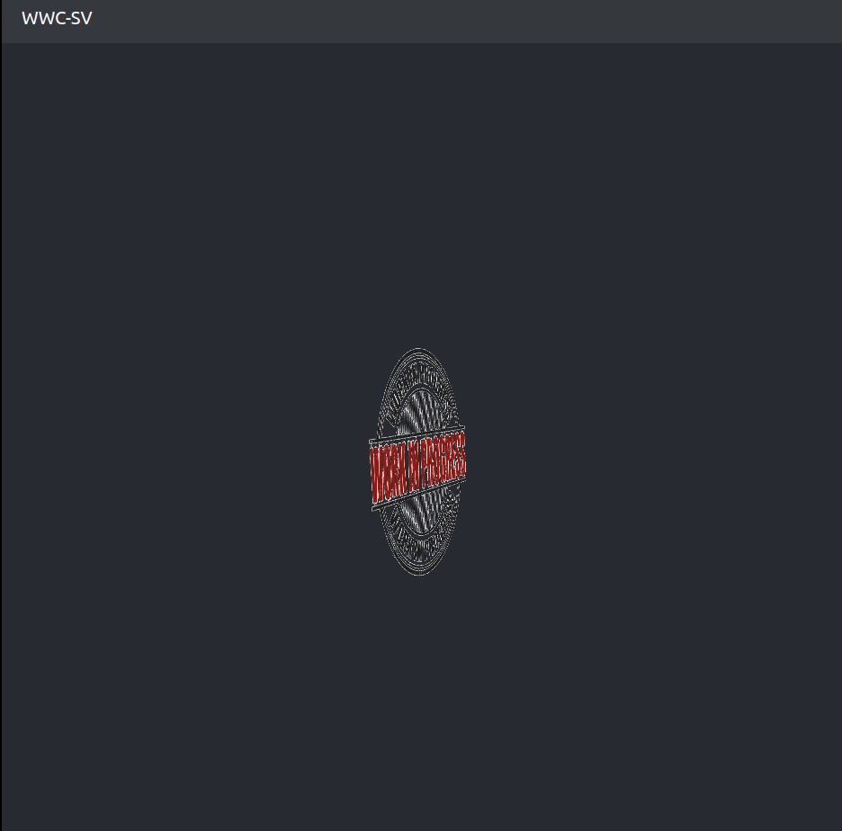

# Front-end application 

 - Basic starter template
 - React application created using [Create React App](https://github.com/facebook/create-react-app).  

## Additionaly installed packages

 - react-router-dom
 - axios

## Requirements

 - Docker needs to be installed on your machine.
 - See [here](https://docs.docker.com/engine/install/) to find the download instructions that best fit your operating system.

## Steps to run the application

 - In the terminal, navigate to the frontend directory in the project.

 - Running `docker-compose up` will install all the dependencies and run the application

 -  Open [http://localhost:3000](http://localhost:3000) to view it in the browser.  
    
    
## To add features

 - Ensure that the current branch is the **development** branch
 - Create a new branch for your feature
 - To use axios, just import axios into the component  
 `import axios from 'axios';`  
- We are ready to add features!

